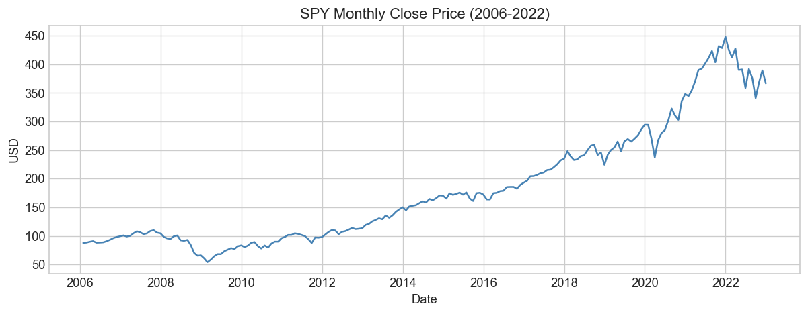
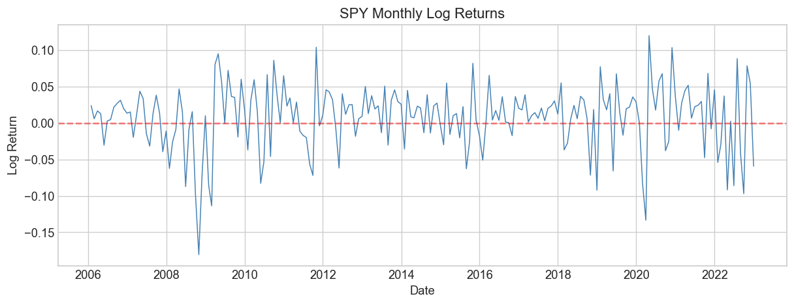
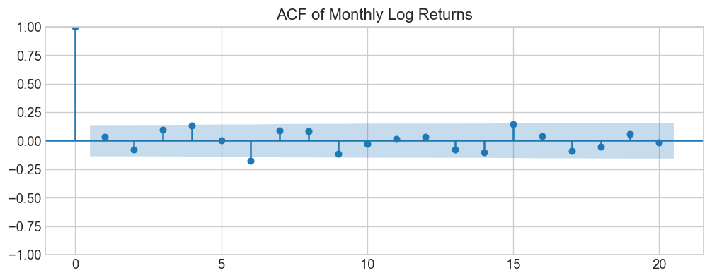
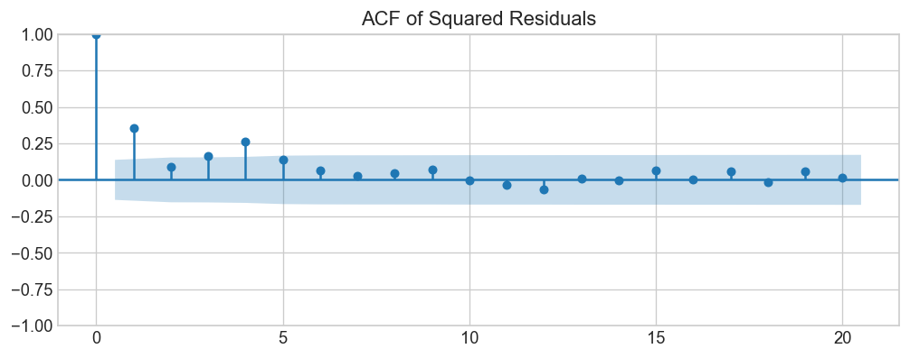
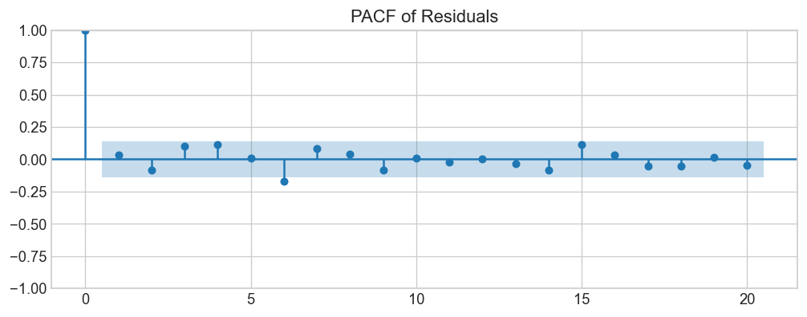
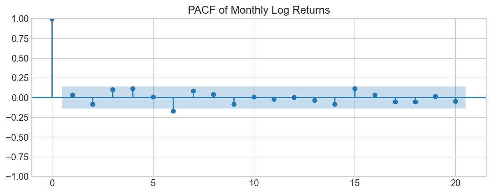
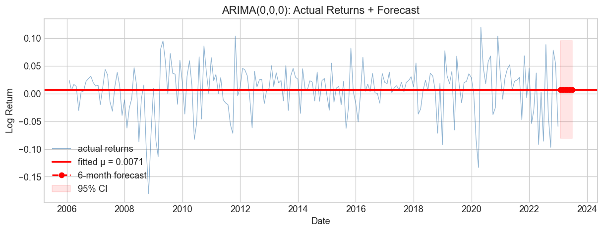
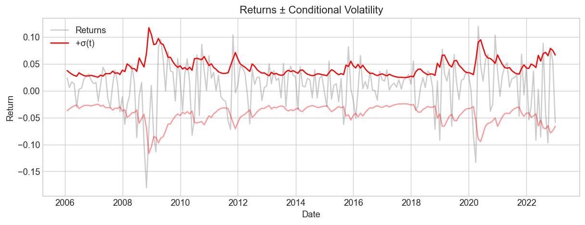
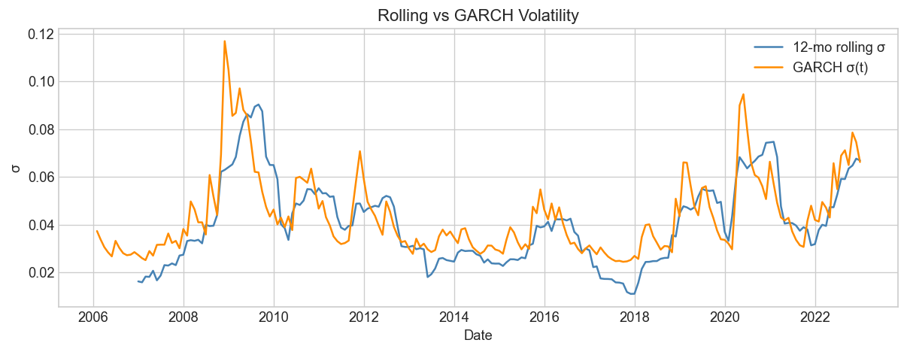
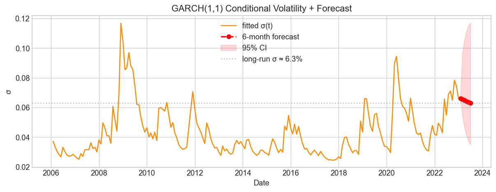

# Time Series Modeling of S&P 500 Returns

**Course:** SI509: Time Series Analysis
**Student:** Kamesh Dubey (22N0088)
**Program:** MSc. Applied Statistics and Informatics, IIT Bombay
**Instructor:** Prof. Sanjeev V Sabnis
**Session:** Spring 2024

## Introduction

Monthly log returns of **SPY (S&P 500 ETF)**, Jan 2006 to Dec 2022 (204 obs).
Covers 2008 GFC and 2020 COVID. We fit ARIMA for the mean and GARCH for volatility,
all model choices driven by AIC/BIC. Full report: [report.pdf](report/report.pdf)

## Key Plots

### Price Series

~$65 (2006) to ~$370 (2022). three dips: 2008 GFC, COVID 2020, 2022 drawdown.

### Monthly Returns

volatility clustering visible: big swings in 2008-09, 2020, 2022.

### ACF of Returns

almost all lags inside 95% band. past returns dont help predict future returns. no significant AR or MA structure.

### ACF of Squared Log Returns

significant autocorrelation in squared returns confirms ARCH effects — past volatility helps predict future volatility.

### PACF of Squared Log Returns

significant spike at lag 1 suggests GARCH(1,1) as the appropriate volatility model.

### PACF of Returns

same story, nothing significant. both ACF and PACF point to ARIMA(0,0,0) as the best mean model: just a constant mean plus noise.

### ARIMA(0,0,0) Forecast

forecast is flat at μ = 0.0071. 95% CI shows uncertainty. extreme months (2008, 2020) blow past the band.

### GARCH Conditional Volatility

GARCH(1,1) bands adapt to changing volatility. widen during crises, tighten during calm.

### Rolling vs GARCH Volatility

GARCH reacts faster to shocks. rolling estimate is smoother but lagged.

### GARCH Volatility Forecast

fitted σ(t) in orange, 6-month forecast in red with 95% CI (10,000 simulations). mean-reverts toward σ ≈ 5.4%.

## Summary

| step | result |
|---|---|
| data | 204 monthly obs, Jan 2006 to Dec 2022 |
| stationarity | ADF p < 0.05, KPSS p > 0.05, both confirm I(0) |
| mean model | ARIMA(0,0,0), μ̂ = 0.0071, p = 0.041 < 0.05 |
| ARCH-LM | all lags p < 0.05, ARCH effects present |
| vol model | GARCH(1,1) selected by BIC |
| α₁ | 0.288, p = 0.003 < 0.05 |
| β₁ | 0.646, p < 0.05 |
| persistence | α₁ + β₁ = 0.934, half-life ≈ 10.1 months |
| long-run σ | ≈ 5.38% per month |
| LB on z_t | all p > 0.05, no serial correlation |
| LB on z_t² | all p > 0.05, no remaining ARCH |

### Limitations
- still monthly data, daily (~4000 obs) would give tighter CIs
- normal errors assumed but JB rejected (kurtosis = 4.46). Student-t would be better
- no EGARCH/GJR-GARCH tested for leverage effect
- Ljung-Box borderline at longer lags in mean model residuals

### Future Work
- fit EGARCH or GJR-GARCH to test for leverage effect
- use Student-t error distribution instead of normal
- redo the full analysis on daily data for stronger inference
- rolling window out-of-sample VaR backtesting

## Project Structure

```
time-series-analysis/
│
├── data-download.ipynb              # 1. download SPY data from Yahoo Finance
├── eda.ipynb                        # 2. preprocessing, EDA, stationarity tests
├── mean-modeling.ipynb              # 3. ARIMA selection, diagnostics, ARCH test
├── volatility-modeling.ipynb        # 4. GARCH selection, diagnostics, forecast
├── requirements.txt                 # pip install -r requirements.txt
├── README.md
│
├── data/
│   ├── SPY-2005-12-01-to-2023-02-01.csv   # raw daily prices
│   ├── monthly_processed.pkl               # monthly prices + log returns
│   └── mean_model_results.pkl              # ARIMA results passed to GARCH
│
├── plots/                           # all generated plots (27 total)
│
├── img/                             # images for report
│
└── report/
    ├── report.tex                   # LaTeX source
    └── report.pdf                   # compiled report
```

Run notebooks in order: 1 → 2 → 3 → 4. Each saves intermediate results for the next.
